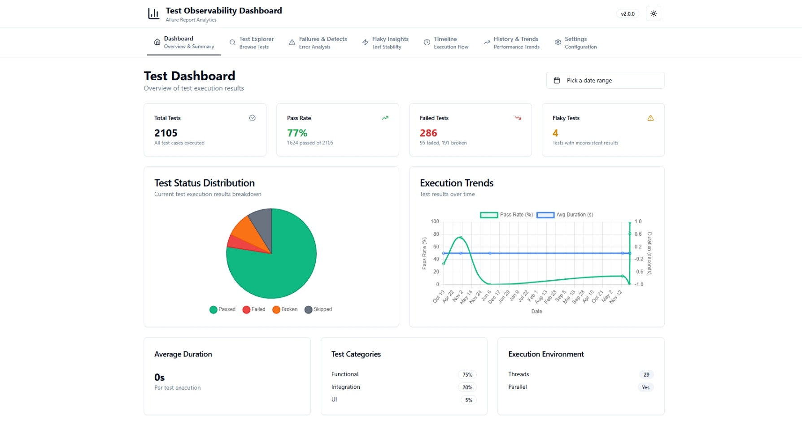
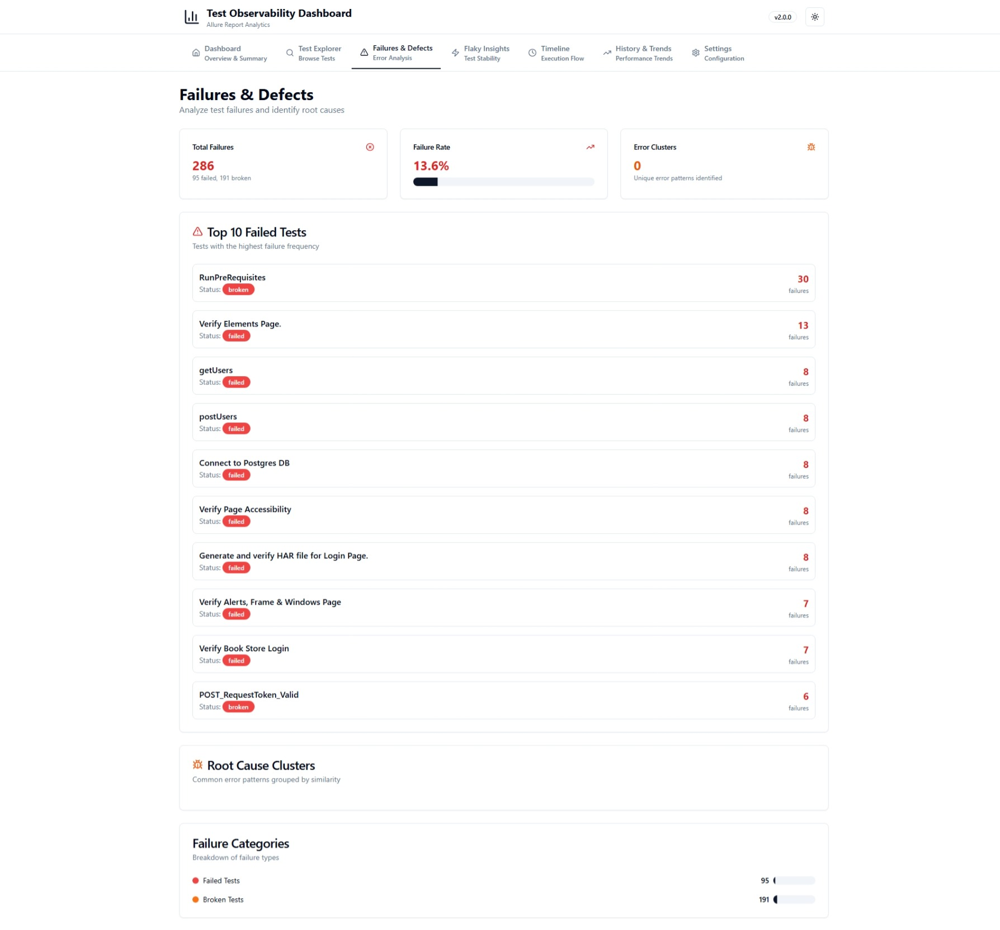
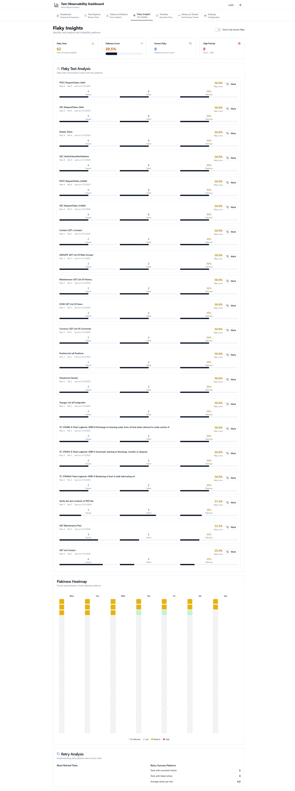
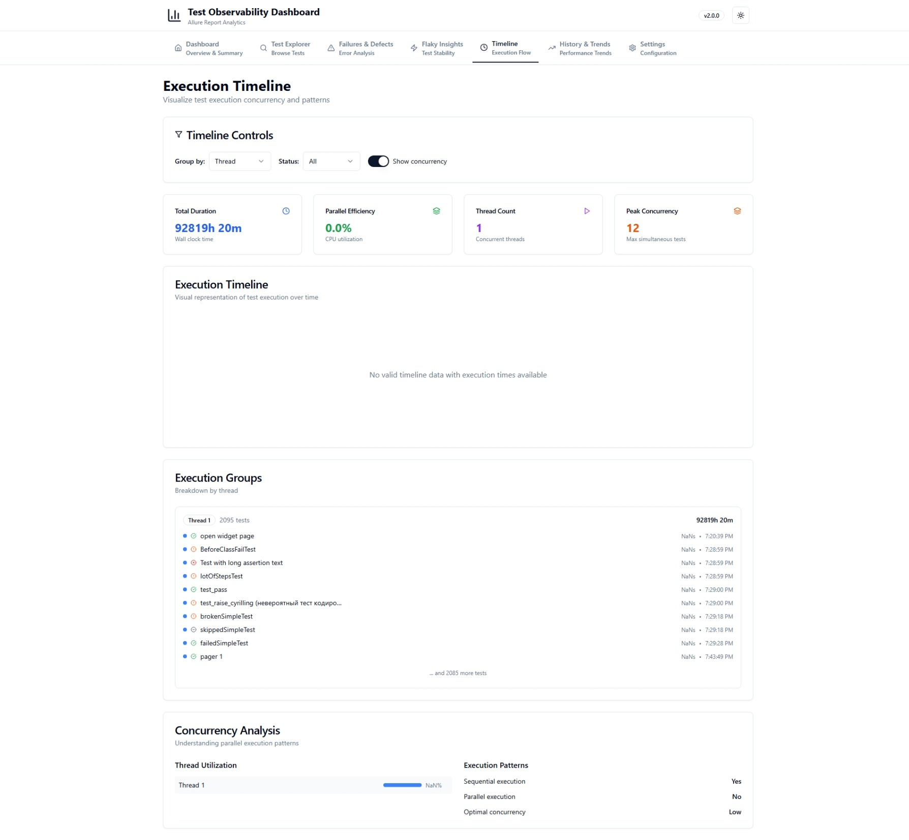
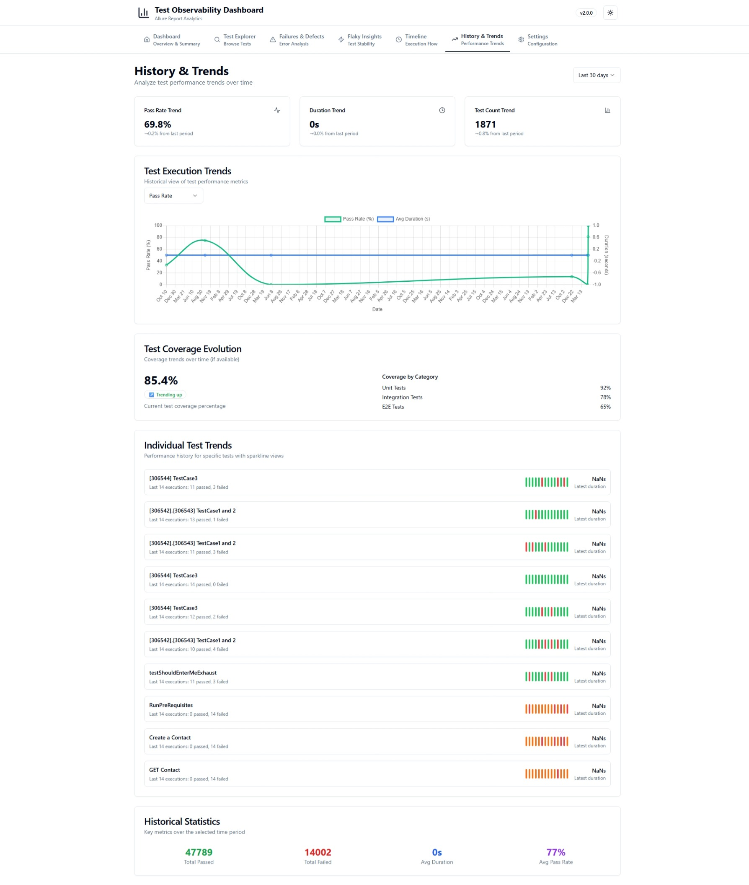
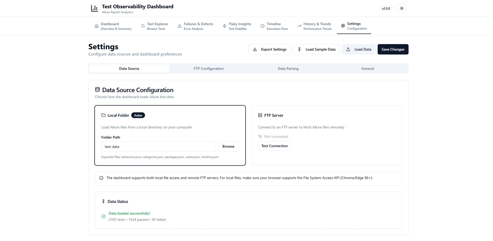

# Test Observability Dashboard

A comprehensive web-based dashboard for analyzing Allure test execution results with advanced observability features, built with React, TypeScript, and Tailwind CSS.

## 🌟 Features

### Core Functionality
- **📁 Multiple Data Sources**: Load test data from local filesystem or FTP server
- **📊 Interactive Charts**: Test status distribution, execution trends, and timeline visualization
- **🔍 Advanced Search & Filtering**: Deep filtering by status, package, suite, thread, duration, and more
- **📈 Real-time Analytics**: Live updates and interactive data exploration
- **🌓 Dark/Light Theme**: Toggle between dark and light modes
- **📤 Export Capabilities**: Export results to CSV, JSON, and PDF formats

### Advanced Analytics
- **🔄 Flaky Test Detection**: Automatically identify tests with inconsistent results
- **🔁 Retry Analysis**: Track test retry patterns and success rates
- **🧩 Failure Clustering**: Group similar failures and identify common error patterns
- **⚡ Performance Metrics**: Duration analysis, slowest/fastest tests, and performance distribution
- **🕐 Timeline Visualization**: Gantt chart showing parallel test execution across threads







### Allure JSON Support
Complete support for all Allure report files:
- `behaviors.json` - Main test execution data
- `categories.json` - Test categorization and grouping
- `packages.json` - Package/module organization
- `suites.json` - Test suite hierarchy
- `timeline.json` - Execution timeline and threading

### Developer Features
- **🔌 REST API**: Programmatic access to test data and analytics
- **📡 Webhook Integration**: Generate payloads for external systems
- **🔍 Debug Mode**: Detailed error information and debugging tools
- **📋 Environment Comparison**: Compare results across different environments
- **🚨 Smart Alerts**: Configurable notifications for test failures and trends

## 🚀 Getting Started

### Prerequisites
- Node.js 18+ and npm/yarn/bun
- Modern web browser with ES2020+ support

### Installation
```bash
# Clone the repository
git clone <repository-url>
cd lovable-observability-dashboard

# Install dependencies
npm install

# Start development server
npm run dev
```

### Building for Production
```bash
# Build the application
npm run build

# Preview the build
npm run preview
```

## 📖 Usage

### Loading Test Data

#### Local Filesystem
1. Click "Open Folder" button in the dashboard
2. Select a folder containing Allure JSON files
3. The dashboard will automatically scan and load all supported files

#### File Upload (Fallback)
1. If running in a restricted environment, use "Upload Files"
2. Select individual JSON files or multiple files at once
3. Supported file types: behaviors.json, categories.json, packages.json, suites.json, timeline.json

#### FTP Server
1. Go to Settings and configure FTP connection
2. Enter host, port, credentials, and remote path
3. Click "Load from FTP" to fetch test data

### Advanced Search & Filtering

The dashboard provides powerful filtering capabilities:

- **Text Search**: Search across test names, packages, suites, and error messages
- **Status Filter**: Filter by passed, failed, broken, or skipped tests
- **Package/Suite Filter**: Filter by specific packages or test suites
- **Thread Filter**: Filter by execution thread for parallel test analysis
- **Duration Range**: Filter tests by execution time
- **Special Filters**: Show only flaky tests or tests with retries

### Analytics Tabs

#### Flaky Tests
- **Detection**: Automatically identifies tests with inconsistent results
- **Scoring**: Calculates flakiness score based on pass/fail ratio
- **History**: Shows execution history and patterns

#### Retry Analysis
- **Statistics**: Total retries, retry success rate, most retried tests
- **Patterns**: Identifies which tests require retries most frequently
- **Success Rate**: Analysis of retry effectiveness

#### Failure Clustering
- **Error Grouping**: Groups similar failures by error type and message
- **Pattern Recognition**: Identifies common failure patterns
- **Impact Analysis**: Shows which tests are affected by each cluster

#### Performance Metrics
- **Duration Analysis**: Average, fastest, and slowest test execution times
- **Distribution**: Histogram of test duration ranges
- **Trends**: Performance trends over time

### Export Options

#### CSV Export
- Exports filtered test results with all metadata
- Includes execution times, status, packages, suites, and error messages
- Compatible with Excel and other spreadsheet applications

#### JSON Export
- Complete export including metadata, summary, and analytics
- Structured format for programmatic processing
- Includes all advanced analytics data

#### PDF Report
- Comprehensive test report with summary and analytics
- Professional formatting suitable for stakeholders
- Includes flaky test analysis and failure patterns

## 🔌 API Integration

The dashboard exposes a REST API for programmatic access:

### Available Endpoints

```javascript
// Access via browser console or external scripts
window.TestObservabilityAPI.getSummary()
window.TestObservabilityAPI.getTests({ status: 'failed', limit: 10 })
window.TestObservabilityAPI.getFailedTests()
window.TestObservabilityAPI.getFlakyTests()
window.TestObservabilityAPI.getPerformanceMetrics()
window.TestObservabilityAPI.getRetryAnalysis()
window.TestObservabilityAPI.getFailureClusters()
window.TestObservabilityAPI.getTimeline()
window.TestObservabilityAPI.getHealthStatus()
```

### Webhook Integration

Generate webhook payloads for external systems:

```javascript
const payload = window.TestObservabilityAPI.generateWebhookPayload(true);
// Send to your external system (Slack, Teams, Jenkins, etc.)
```

### Health Status API

Monitor test health programmatically:

```javascript
const health = window.TestObservabilityAPI.getHealthStatus();
// Returns: { status: 'healthy|warning|critical', passRate, flakyTestCount, ... }
```

## 🏗️ Architecture

### Technology Stack
- **Frontend**: React 18, TypeScript, Tailwind CSS
- **Charts**: Chart.js with react-chartjs-2
- **UI Components**: Radix UI primitives with custom styling
- **Build Tool**: Vite
- **Package Manager**: Bun (npm/yarn compatible)

### Project Structure
```
src/
├── components/          # Reusable UI components
│   ├── charts/         # Chart components (Status, TimeSeries, Gantt)
│   ├── ui/             # Base UI components (shadcn/ui)
│   └── widgets/        # Complex widgets (Analytics, Search, Export)
├── context/            # React context providers
├── hooks/              # Custom React hooks
├── lib/                # Utility libraries
├── pages/              # Application pages
├── services/           # Data services (file, FTP, API)
├── types/              # TypeScript type definitions
└── utils/              # Utility functions and parsers
```

### Data Flow
1. **Data Loading**: File/FTP services load Allure JSON files
2. **Parsing**: Utility functions parse and aggregate test data
3. **Analytics**: Advanced analytics are calculated from parsed data
4. **Context**: Data is stored in React context for global access
5. **Components**: UI components consume data and provide interactivity
6. **API**: REST API exposes data for external integration

## 🔧 Configuration

### Environment Variables
```bash
# Optional: Configure default FTP settings
VITE_DEFAULT_FTP_HOST=your-ftp-server.com
VITE_DEFAULT_FTP_PORT=21
VITE_DEFAULT_FTP_PATH=/allure-results
```

### Theme Customization
The dashboard uses Tailwind CSS with CSS custom properties for theming. Modify `src/index.css` to customize colors and appearance.

## 🤝 Contributing

1. Fork the repository
2. Create a feature branch (`git checkout -b feature/amazing-feature`)
3. Commit your changes (`git commit -m 'Add amazing feature'`)
4. Push to the branch (`git push origin feature/amazing-feature`)
5. Open a Pull Request

### Development Guidelines
- Follow TypeScript best practices
- Use existing UI components from the component library
- Add proper error handling and loading states
- Write descriptive commit messages
- Test new features thoroughly

## 📝 Changelog

### Version 2.0.0 (Current)
- ✨ Added advanced analytics (flaky tests, retry analysis, failure clustering)
- ✨ Implemented parallel execution timeline with Gantt chart
- ✨ Added comprehensive search and filtering
- ✨ Integrated export functionality (CSV, JSON, PDF)
- ✨ Added REST API for external integration
- ✨ Implemented dark/light theme toggle
- ✨ Enhanced support for all Allure JSON files
- 🐛 Fixed TypeScript typing issues
- 🎨 Improved UI/UX with better responsiveness

### Version 1.0.0
- 🎉 Initial release with basic dashboard functionality
- 📊 Test status charts and basic analytics
- 📁 Local folder and FTP data loading
- 📅 Date range filtering
- 📋 Test results table

## 📄 License

This project is licensed under the MIT License - see the [LICENSE](LICENSE) file for details.

## 🙏 Acknowledgments

- [Allure Framework](https://docs.qameta.io/allure/) for the test reporting standard
- [Chart.js](https://www.chartjs.org/) for visualization capabilities
- [Radix UI](https://www.radix-ui.com/) for accessible UI primitives
- [Tailwind CSS](https://tailwindcss.com/) for utility-first styling
- [Vite](https://vitejs.dev/) for fast development and building

## 🆘 Support

For support, bug reports, or feature requests:
1. Check existing [GitHub Issues](issues)
2. Create a new issue with detailed description
3. Include browser information and steps to reproduce

---

**Built with ❤️ for better test observability**
